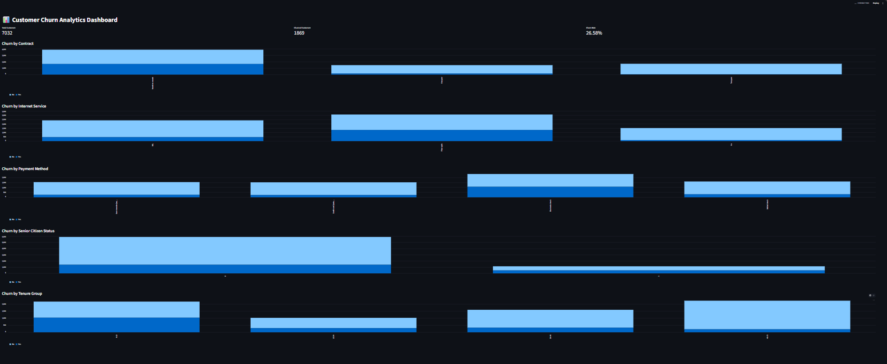

\# Customer Churn Analytics


\## Project Overview


This project analyzes telecom customer churn using Python and Streamlit.


The goal is to identify customer segments with high churn rates and understand the factors that may contribute to customer cancellations.


\## Dataset


The project uses the Telco Customer Churn dataset containing customer information such as:


\- Customer demographics

\- Contract type

\- Internet service

\- Payment method

\- Monthly charges

\- Total charges

\- Customer tenure

\- Churn status


\## Data Cleaning


The dataset was cleaned using Python and Pandas.


Steps included:


\- Checking missing values

\- Converting `TotalCharges` to numeric format

\- Removing rows with missing `TotalCharges`

\- Creating customer tenure groups


After cleaning, the dataset contains \*\*7,032 customers\*\*.


\## Key Findings


\- Overall churn rate: \*\*26.58%\*\*

\- Month-to-month customers have the highest churn rate: \*\*42.71%\*\*

\- Two-year contract customers have the lowest churn rate: \*\*2.85%\*\*

\- Fiber optic customers have a churn rate of \*\*41.89%\*\*

\- Electronic check customers have a churn rate of \*\*45.29%\*\*

\- Customers with 0–12 months tenure have the highest churn rate: \*\*47.68%\*\*


\## Dashboard


The Streamlit dashboard displays:


\- Total customers

\- Churned customers

\- Overall churn rate

\- Churn by contract type

\- Churn by internet service

\- Churn by payment method

\- Churn by senior citizen status

\- Churn by tenure group


\## Technologies Used


\- Python

\- Pandas

\- Matplotlib

\- Seaborn

\- Streamlit


\## Project Structure


```text

Customer\_Churn\_Analytics/

│

├── data/

│   ├── WA\_Fn-UseC\_-Telco-Customer-Churn.csv

│   └── cleaned\_churn\_data.csv

│

├── churn\_analysis.py

├── dashboard.py

├── README.md

├── churn\_distribution.png

├── churn\_by\_contract.png

├── churn\_by\_internet\_service.png

├── churn\_by\_payment\_method.png

├── churn\_by\_senior\_citizen.png

└── churn\_by\_tenure\_group.png
### Dashboard Preview



